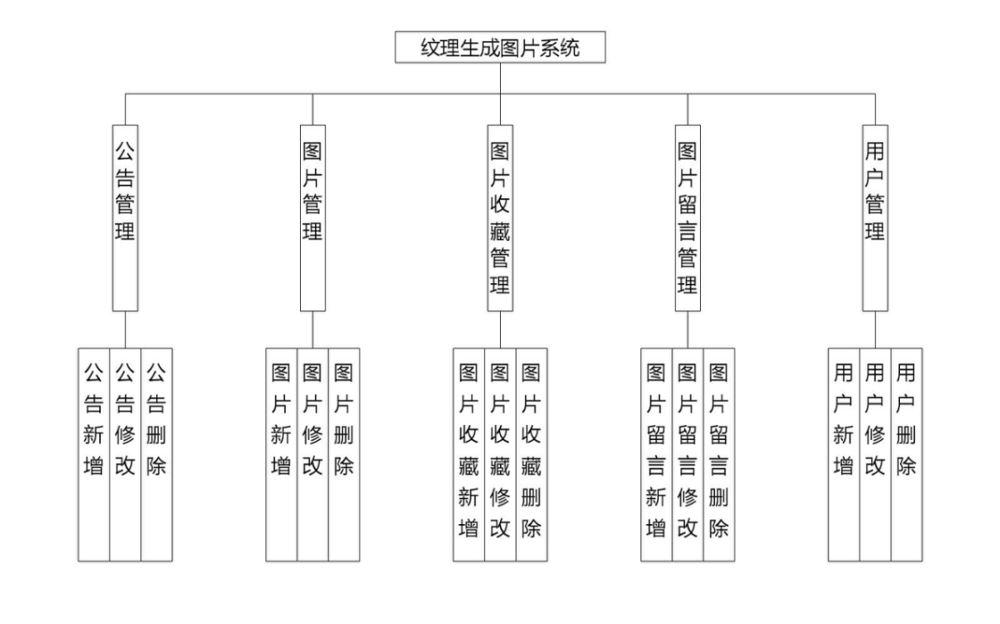
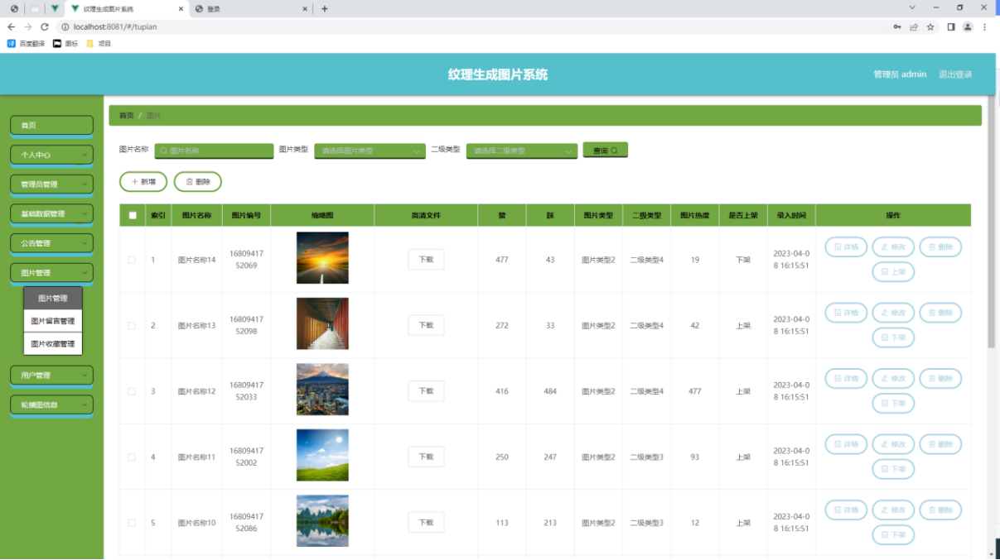
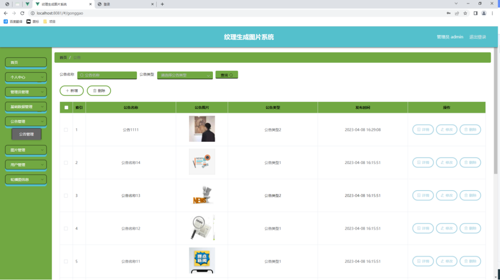
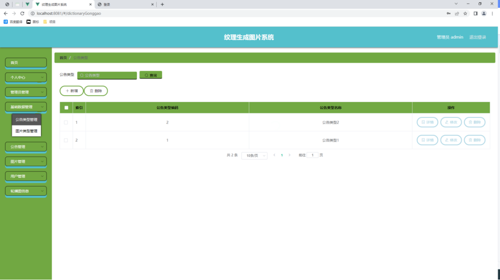
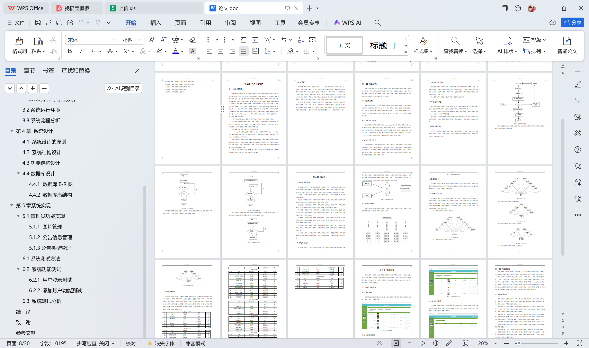

# springboot269-基于SpringBoot的纹理生成图片系统

>  博主介绍：
>  Hey，我是程序员Chaers，一个专注于计算机领域的程序员
>  十年大厂程序员全栈开发‍ 日常分享项目经验 解决技术难题与技术推荐 承接各类网站设计，小程序开发，毕设等。
>  【计算机专业课程设计，毕业设计项目，Java，微信小程序，安卓APP都可以做，不仅仅是计算机专业，其它专业都可以】

## 本项目获取地址：https://www.bishecode.com/product/265/

## 3000套系统可挑选，获取链接：https://www.bishecode.com/

### 系统架构

> 前端：html | js | css | jquery | vue
>
> 后端：springboot | mybatis
> 
> 环境：jdk1.8+ | mysql | maven

# 一、内容包括
包括有  项目源码+项目论文+数据库源码+答辩ppt+远程调试成功

# 二、运行环境

> jdk版本：1.8 及以上； ide工具：IDEA； 数据库: mysql5.7及以上；编程语言: Java

# 三、需求分析

**3.1可行性分析**

开发一款系统软件之前，用户都会思考这个软件程序值不值得去开发，把开发软件过程中可能涉及到的问题罗列出来，并一个个分析解决，以此来确定开发这款程序软件是否有必要，这样的分析方法也能帮助用户降低损失，不至于开发者开发进度进行到一半之后，突然遇到问题就放弃对软件的开发，到那时，资金损失，人力投入等方面就损耗太大了。

**3.1.1技术可行性分析**

此次开发程序使用到的开发工具有：Idea，MySQL等工具，使用的开发语言是Java，选择的开发工具和开发语言都是在大学课堂接触并学习过，后期因为自己也比较感兴趣，所以也通过网络渠道，或借助图书馆的开发类书籍进行过软件开发知识的系统学习，让自己有了一定的知识积累，加上自己在校期间也独立开发过一些软件作品，也积累了一定的开发经验，所以这次毕设作品的制作在技术上无须担忧过多。

**3.1.2经济可行性分析**

目前的信息时代，对信息的管理趋于高效化，便捷化，这也是计算机大力普及所带来的便利，此程序软件在设备选用上，依靠的是比较大众的电脑设备，对电脑的配置没有过多要求，一般学校的计算机机房的电脑都可以满足程序开发需求，另外，开发出此款程序，让信息处理变得高效率，其所带来的高效益是远超程序开发的低成本的，因此程序开发的资金投入是可以忽略不计的。

**3.1.3操作可行性分析**

程序软件的操作界面是符合大众审美的需求，功能模块的布局也是类似于社会上同种类型的软件，因此使用者操作该软件可以无需培训就上手。加上现在计算机入驻各家各户，大部分人的计算机操作水平都比较高，这样的局面也表明开发出来的程序在操作性问题上也是不用担心的。
综合上面的可行性论证，基本可以确定程序开发完全可行。

**3.2系统运行环境**

程序经过编码可以实现对程序设计的功能。但是编码实现时需要一定的配置环境，包括了电脑上的硬件环境，也包括在电脑操作系统上安装的软件环境。
硬件环境：一台可以正常使用并能够上网的笔记本或者是电脑，电脑内存最低要求4个G，电脑的中央处理器可以配置i5CPU。
软件环境：运用的微软操作系统是比较稳定的win7旗舰版系统，采用比较熟练360安全浏览器，并在此系统上通过浏览器下载安装好Idea软件，下载安装好MySQL软件等。

**3.3系统流程分析**

分析程序的流程，涉及到程序的整体操作流程，通过分析与设计，绘制的程序操作流程图见下图。此程序为了确保安全，会让使用者通过登录模块验证信息，符合要求的使用者才有权限操作程序。

# 四、功能模块

在管理员功能模块确定下来的基础上，对管理员各个功能进行设计，确定管理员功能的详细模块。绘制的管理员功能结构见下图。

# 五、效果图展示【部分效果图】

图5-1 图片管理页面【此页面让管理员管理图片的数据，图片管理页面见下图。此页面主要实现图片的增加、修改、删除、查看的功能。】

图5.2 公告信息管理页面【公告信息管理页面提供的功能操作有：新增公告，修改公告，删除公告操作。下图就是公告信息管理页面。】

图5.3 公告类型列表页面【公告类型管理页面显示所有公告类型，在此页面既可以让管理员添加新的公告信息类型，也能对已有的公告类型信息执行编辑更新，失效的公告类型信息也能让管理员快速删除。下图就是公告类型管理页面。】

 <b>完整文章</b>
 

 

## 本项目获取地址：https://www.bishecode.com/product/265/

## 3000套系统可挑选，获取链接：https://www.bishecode.com/

